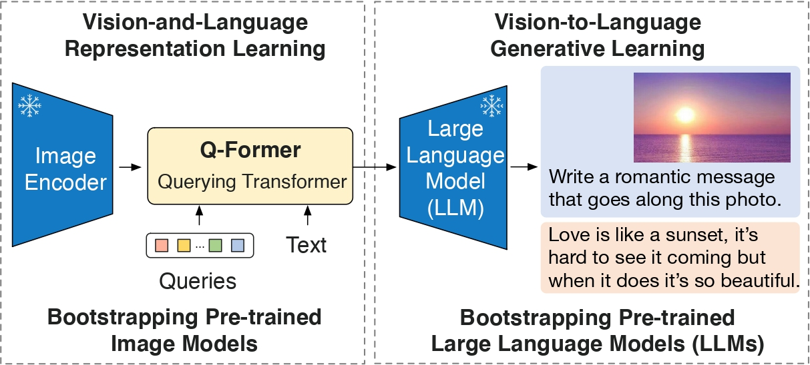
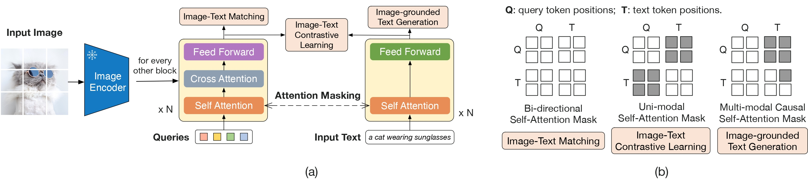
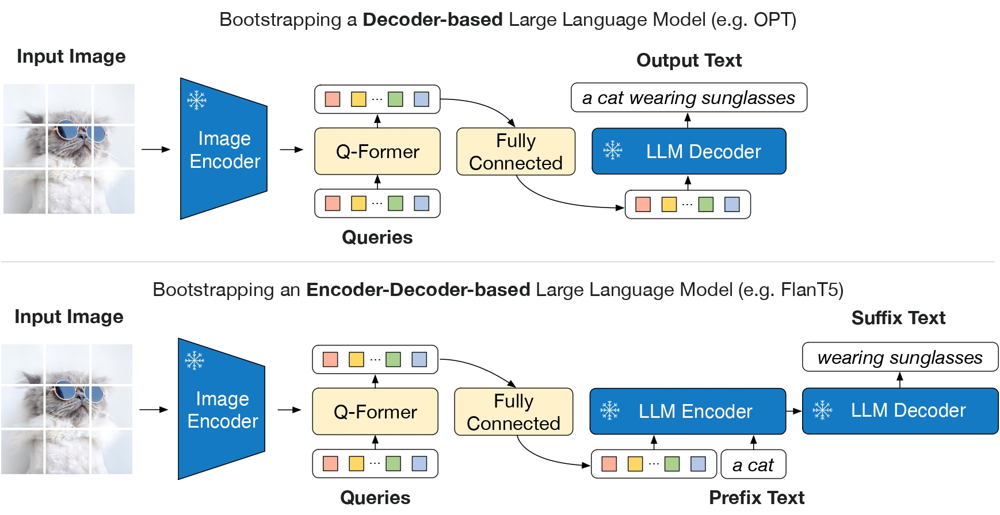

# BLIP-2: Bootstrapping Language-Image Pre-training with Frozen Image Encoders and Large Language Models

## Abstract

### 기존 방식의 문제점

- Multi-Modal을 Scratch부터 학습을 시키자니 많은 양의 자원을 필요로 함.

### 논문이 제안하는 방식

- 적은 자원으로 모달을 학습시키기 위해 사전학습이 되어 있으면서 고정되어 있는 Vision 모델과 Langauge 모델을 사용해 Multi-Modal을 구현

## Introduction

- OFA, M3AE, BEIT-3, ALBEF 등 CLIP과 같은 Vision 신호와 Langauge 신호를 학습에 사용하는 멀티 모달이 많이 등장하고 있다.
    하지만 end-to-end 사전학습을 위해 여전히 많은 양의 자원이 필요하단 문제가 있음.

- 적은 자원으로 모달을 학습시키기 위해 사전학습 되어 있는 Vision 모델과 Langauge 모델을 사용.
    다만 자원의 절약과 망각을 방지하는 측면으로 각 모달을 얼려서 학습을 진행.

- 하지만 각 모달을 얼린 상태로 학습하면 각 모달별로 신호를 정렬하는 것이 어려움.  
    대안으로 Vision, Langauge 신호를 서로 정렬하기 위한 2-stage 학습 기법과 Q-Former를 제안 함.
    1. 1 step: 고정된 Vision 모델이 출력한 신호를 Q-Former에 입력해 학습에 필요한 핵심 특징을 추출
    2. 2 step: 고정된 Vision 모델과 연결된 Q-Former를 LLM에 연결해 LLM을 통한 생성 학습

## Method

- 사전학습 되어 있는 Vision 모델과 Langauge 모델의 신호 차를 줄이기 위해 Q-Former를 사용.
    Q-Former를 학습시키기 위해 2-stage 학습 기법을 사용해 Q-Former를 학습

### Model Architecture

- 고정된 상태의 Vision, Langauge 모델 간의 신호 차를 줄이기 위해 Q-Former를 시용
    Q-Former는 입력되는 이미지 해상도와 상관 없이 Vision 모델로 부터 고정된 길이의 신호만 추출.

- Q-Former는 두개의 transformer 구조로 구성되어 있음
    각 Image Transformer와 Text Transformer는 서로 공유되는 Self-Attention를 보유하고 있음.
    1. Vision 모델로 부터 해상도 관계 없이 고정된 크기의 신호를 추출하기 위한 Image Transformer
    2. text encoder & decoder로 동작할 수 있는 Text Transformer

NOTE: (Self-Attention Layer를 공유하는 이유로 Image, Text Transformer의 입력으로 Query를 받아서 처리하기 때문에 공유하는 것이 아닌가 추측함. 왜 공유를 하는지 아직 이해가 필요)

- Q-Former 학습 시 학습 가능한 Query 임베딩 토큰을 추가 함.
    1. Image Transformer의 Self-Attention을 통과한 Query와 고정된 크기의 Vision신호를 Cross-Attention을 해서 Query가 Vision 신호에서 학습에 필요한 정보를 추출 할 수 있도록 함.
    2. Text Transformer에선 Query를 이용해 Text를 생성케 해서 Query가 Text를 고려할 수 있도록 함.

- Q-Former의 세팅은 다음과 같음.
    1. 사전학습된 BERT 가중치로 Image Transformer, Text Transformer를 초기화
    2. Image Transformer에서 사용하는 Cross-Attention은 Random Init을 수행
    3. Query의 차원은 768 차원의 고정된 크기를 가지고 있는 학습 가능한 파라메터, 그리고 Query는 모델의 일부로 간주 함.

### Bootstrap Vision-Language Representation Learning from a Frozen Image Encoder

- 1 stage에서 고정된 Vision 모델과 Q-Former에 Image-Text 쌍의 데이터를 입력해 Q-Former에서의 Query를 학습시킴.
    이때 Q-Former는 정보량이 많은 Image에서의 시각적인 특징을 추출할 수 있도록 학습 하는 것을 목표로 함.
    학습을 위해 ITC, ITM, ITG loss를 동시에 최적화 시킴.

#### Image-Text Contrastive Learning(ITC)

- Image Transformer, Text Transformer에서 출력된 image, text 신호를 Contrastive Loss
    이 때 Text Transformer는 pooling 전략으로 `[CLS]`를 선택.
    ITC는 CLIP과 학습 방식이 동일

#### Image-grounded Text Generation(ITG)

- Text Transformer에서 출력된 image에 대한 Text 신호로 부터 Text를 생성해 Label과의 CrossEntropy Loss
    Image Transformer는 Text Transformer와의 직접적인 상호작용이 되질 않아 생성에 필요한 정보를 Text Transformer에 전달해줄 수 없음.
    그래서 Image Transformer를 통과한 Query로 부터 생성에 필요한 정보를 얻게됨.
    이를 위해 Query를 Text Transformer의 입력 값으로 사용해 Text를 생성함.

    이 과정에서 Query는 생성을 위해 Image Transformer로 부터 Text 생성에 필요한 핵심 값들을 추출하는 방법을 학습하게 됨.
    Query-Text를 가능케 하기 위해 Text Transformer에 Casual Attention Mask를 입력해 학습을 진행.
    Text Transformer의 `[BOS]` 토큰을 `[DEC]` 토큰으로 대체 시킴
    NOTE: (아마 LLM과 Text Transformer가 사용하는 토큰의 구분을 위해 이렇게 바꾼것이 아닌가 하고 추측, 그럼 EOS도 바꿔야 하지 않나? 이 부분은 확인 필요)

#### Image-Text Matching(ITM)

- Image Transformer에 positive image-text(match)와 negative image-text(unmatch) 쌍을 입력해 positive(1), negative(0)와 label 과의 CrossEntropy Loss
    Potitive Image & Text, Negative Text & Image, Negative Image & Text를 입력해 Positive Image & Text는 1, Negative Text & Image, Negative Image & Text는 0으로 학습
    이 과정에서 Bi-directional-Attention-Mask(일반 Attention Mask 생각하면 됨)을 사용해 학습을 진행 함.
    Negative set을 얻기 위해 [Li](*)가 제안한 하드 네거티브 마이닝 전략을 사용해 네거티브 샘플링을 수행 함.

### Bootstrap Vision-to-Language Generative Learning from a Frozen LLM

- 2 stage에서 고정된 Vision 모델이 연결된 상태의 Q-Former를 LLM에 연결해 LLM에서의 생성 테스크를 수행 함.
    Q-Former를 통과한 Query 임베딩 토큰을 LLM에 입력할 수 있게 하기 위해 Projection Layer를 통해 선형변환 시켜 크기를 LLM에 맞춤
    이후 Projection Layer를 통과한 Query 임베딩 토큰을 LLM의 input text 임베딩에 추가해 LLM의 Transformer Block에 같이 입력된다.

- Q-Former는 Vision 모델로 부터 추출한 Vision 신호를 language 모델이 이해할 수 있는 형태로 학습을 거침
    이 과정에서 language 모델에 필요로 하지 않은 정보는 필터링 하여 정보에 대한 병목 현상을 완화할 수 있음.
    그리고 기존 방식 대비 Q-Former를 통해 시각 정보를 전달하기 때문에 고정된 language 모델은 망각 문제에서 자유로워 짐

### Model Pre-training
