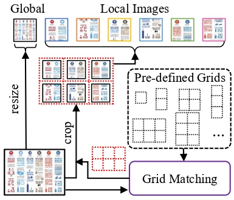

# UReader: Universal OCR-free Visually-situated Language Understanding with Multimodal Large Language Model

## Abstract

### 기존 방식의 문제점

- 최근 MLLM의 뛰어난 성능 덕분에 저 해상도 이미지에 대해서도 어느정도의 ZeroShot OCR 등이 가능하게 됨.
하지만 테이블, 문서, 웹페이지, 차트 같이 정보량의 밀도가 높은 이미지에선 여전히 성능이 떨어지는 문제가 발생함.

- 기존 OCR을 진행하기 위해선 Pretrain, Finetune, 특정 도메인 별 데이터가 필요로 했음
하지만 학습을 위해서 많은 자원을 필요로 함. (예: Donut은 A100에서 192일 정도 학습을 시켜야 함.)

### 논문이 제안하는 방식

- 개별 OCR 모듈을 학습 시키는 대신 OCR SFT 데이터를 통해 MLLM을 학습시키는 방법을 제안
MLLM 학습을 위한 5가지 영역에(문서, 표, 차트, 자연 이미지, 웹페이지 스크린샷의) 대한 OCR SFT 데이터를 구축함.

- 저 해상도에 맞춰서 학습된 Vision Encoder가 고 해상도 이미지를 처리할 수 있도록 방법을 고안.
고 해상도 이미지를 처리할 수 있도록 shape-adaptive cropping 모듈을 제안 함.

## Introduction

- MLLM의 뛰어난 성능 덕분에 저 해상도 이미지에 포함되어 있는 텍스트에 대해서 어느정도의 OCR 가능하게 됨.
하지만 문서에서 정보 추출, 표에서 시각적 질의응답과 같은 시각적으로 상황을 이해하고 언어적으로 답변하는 능력은 아직 떨어짐.

- 기존의 OCR 학습법은 크게 two-stage와 end-to-end 2가지 방식으로 나뉠 수 있었음.
하지만 이 2가지 방식은 특정 도메인에 대한 Pretrain과 FineTune을 동반하기 때 자원이 많이 필요하단 문제가 있음.
(예: Donut은 A100에서 192일 정도 학습을 시켜야 함.)

- 기존 MLLM도 이미지 속 텍스트를 약하게 인식하는 능력이 있단 점에서 착안해, 적은 자원으로도 범용 OCR을 구축할 수 있는 UReader를 제안.
Vision Encoder를 사전학습 시키는 과정을 생략하는 대신 다양한 도메인의 이미지 데이터를 활용헤 MLLM을 SFT 시킴.

- 고 해상도 이미지를 resize할 때 발생하는 품질저하(흐릿함, 왜곡) 문제를 방지를 위해 고 해상도 이미지를 여러 로컬 이미지로 분할하(패치?)는 shapeadaptive cropping 모듈을 제안 함.
로컬 이미지를 서로 연관 시키기 위해 학습이 가능한 potional encoder를 추가해 분할로 인한 정보 손실을 완화 함.

## UReader

- UReader의 목표는 Vision 모델의 신호를 언어적으로 이해해서, MLLM을 효율적으로 사용하자는 것에 있음.
    MLLM으로 mPLug-Owl를 사용, 추가로 Shape-Adaptive Cropping모듈을 사용해 로컬 이미지에 대해 서로 이해할 수 있도록 함.
    그리고 고해상도 이미지에서 추출된 로컬 이미지로부터 연관성을 학습할 수 있도록 하기 위해 각 positional encoding을 수행 함.

### Shape-Adaptive Cropping Module

- 텍스트가 이미지의 사이즈는 다양해 이를 Resize하게 되면 텍스트가 뭉개지고 왜곡되는 문제가 존재 함.  
    특히 문서나 테이블과 같이 정보에 대한 밀도가 높은 이미지에선 특히 문제가 되기 때문에 Shape-Adaptive Cropping Module을 제안.

- Shape-Adaptive Cropping Module은 다음과 같이 동작.
    1. Origianl_Image를 local_image로 만들기 위해 사전 정의된 Grid를 사용.
        그리드는 다음과 같이 정의됨 ${g=(n_h\times n_w)|n_h\cdot n_w\le N_c, n_h \in \mathbb{N}, n_w \in \mathbb{N}}$
        $n_h$, $n_w$는 각각 열과 행, $N_c$는 local_image의 개수
    2. 입력된 Origianl_Image $I$와 겹치는 그리드를 찾기 위해 [Intersection over Union](https://ballentain.tistory.com/12)(IoU)을 사용해 Origianl_Image와 최대한 겹치는 그리드를 선택.  
        (1) $\mathrm{S_{rr}}(I, g) = \mathrm{IoU}((H, W), (n_hH_v, n_wW_v))$
        (2) $\mathrm{S_{ra}}(I, g) = \mathrm{IoU}((\frac{n_wH}{W}, n_w), (n_h, n_w))$
        (3) $g^{*} = \argmax_{g} (\mathrm{S_{ra}}(I, g) + \mathrm{S_{rr}}(I, g))$  

    3. 그리드를 이용해 Origianl_Image를 local_image로 Crop함.
    4. Origianl_Image와 local_image를 서로 합쳐서 MLLM에 입력

- 이미지와 그리드 간의 해상도와 모양을 측정하기 위해 다음과 같은 수식을 사용해 이를 측정 함.

이 방정식에 따라 이미지를 그리드 개수 만큼 crop하여 로컬이미지로 만듬.

이후 로컬 이미지를 모델에 넣어 각 이미지에 대한 features를 추출한 뒤 이 features를 f_K에 입력해 llm이 이해할 수 있게 요약하는 과정을 거친다.

### Cropped Images Modeling with LLM

- VIT와 같이 local image에 1차원 적인 absolute positional encoding을 시키면 공간적 위치 특성을 반영하지 못하는 문제가 있음.
    그래서 각 그리드의 행과 열에 2 차원 positional encoding을 적용해 상대적인 위치 정보를 고려하게 함.  
    $\mathbf{e}^{row}_{i,j}=\mathrm{Embedding_{row}}(i)$  
    $\mathbf{e}^{column}_{i,j} = \mathrm{Embedding_{column}}(j)$ 
    $\mathbf{e}_{i,j} = \mathbf{e}^{row}_{i,j} + \mathbf{e}^{column}_{i,j}$ 

- 이후 LLM을 학습 시킬 때 LoRA를 적용해 모델을 학습 시킴.

## Instruction Tuning

### Tuning Tasks

#### Unified downstream task

- Multi-Modal SFT 데이터를 이용해 MLLM이 Image와 Text신호에 대해 이해하도록 학습
  1. Visual Question Answering (VQA)
    Image에 대한 Question-Answer 쌍이 주어지고 MLLM이 Answer을 맞추도록 유도
    Instruction: `"Human: {question} AI: {answer}"`

  2. Information Extraction (IE)
    Image내에서의 특정 정보(이름, 날짜, 숫자)를 추출하는 것을 목표로 학습
    Instruction: `"Human: What is the value for the {category}? AI: {value}"`

  3. Natural Language Inference (NLI)
    이미지를 바탕으로 주어진 내용이 참인지, 거짓인지를 판단하도록 학습
    Instruction: `"Human: {statement}, Yes or No? AI: {answer}"`

  4. Image Captioning
    주어진 이미지를 설명하는 Caption을 맞추도록 학습
    Instruction: `"Human: Provide a brief description of the given image. AI: {caption}"`

#### Text Reading task

- 문서는 다양한 폰트과 크기를 가진 Text 들로 구성되어 있어서 Multi-Modal SFT로는 한계가 존재.
    그래서 이를 보조하기 위해 이미지 내의 모든 텍스트를 인식하여 출력하는 방식으로 훈련
    학습으로 Document, Table, Chart, Natural Image, WebPage로 구성된 데이터를 구축

### Instruction Data Resources

- Document
  - DocVQA: 공공 문서 이미지에 대한 질문과 답변 쌍
  - InfoVQA: 인포그래픽스 이미지에 대한 질문과 답변 쌍
  - DeepForm: 선거 지출 관련 문서에 대한 정보가 포함
  - Kleister Charity: 자선 단체 보고서에 대한 정보가 포함

- Table
  - WikiTableQuestions: 위키피디아 테이블 이미지에 대한 질문과 답변 쌍
  - TabFact: 위키피디아 테이블에 대한 자연어 명제가 참인지 거짓인지 판별

- Chart
  - ChartQA: 다양한 도메인에서 수집된 차트 이미지에 대한 질문과 답변 쌍

- Natural Image
  - TextVQA: 자연 이미지 내의 텍스트에 기반한 질문과 답변 쌍
  - TextCaps: 이미지 내 텍스트 정보를 활용한 캡션

- WebPage
  - VisualMRC: 웹페이지의 전체 스크린샷에 대한 질문과 답변 쌍

## Experiments

### Ablation Study
