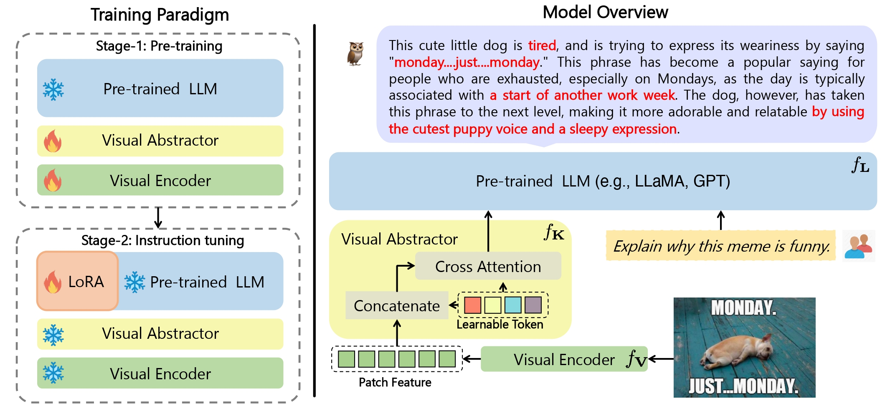

# mPLUG-Owl : Modularization Empowers Large Language Models with Multimodality

## Abstract

### 기존 방식의 문제점

- 기존의 multimodal인 BLIP-2, Llava는 Vision 모델을 얼린 상태에서 language 모델에 LoRA를 붙어 학습을 진행 함.
 그러다 보니 vision 모델과 language 모델 간의 신호가 완전히 정렬되지 않아 재한적인 성능이 낮았음.

- 기존 Multi-Modal LLM은 end-to-end와 systematic collaboration 구조로 구현되고 있었음.
 end to end는 성능은 좋으나 확장이 어렵고, systematic collaboration은 확장은 용이하나 성능이 낮은 문제점이 있었음.

### 논문이 제안하는 방식

- vision 모델과 language 모델 간의 신호 정렬을 위해 2 stage 학습 기법을 제안.
  1. 1-stage: llm은 얼린 상태에서 사전학습 되어 있는 vision encoder에 image-text 데이터를 학습시켜 llm과의 1차 정렬
  2. 2-stage: vision encoder + llm을 얼린 상태에서 lora를 추가한 상태에서 특정 task에 대한 데이터 학습.

- 확장성과 성능이 둘다 높은 모듈화 방식을 제안함.
 LLM 모듈과, Vision 모듈, Vision 모듈과 연결된 추상화 모듈을 구조를 사용해 성능과 확장성을 둘다 고려할 수 있었음.

## Introduction

기존 Multi-Modal LLM(줄여서 MLLM)을 구현하기 위해선 systematic collaboration와 end to end 2가지 방법이 있었음.
systematic collaboration: Visual ChatGPT, MM-REACT, HuggingGPT 등에서 사용하는 방식으로 OCR, STT, image tagging등 다양한 형태의 데이터를 text로 바꿔주는 다른 모델을 사용해 Multi-Modality를 구현하는 방식.
다만 각기 다른 도메인에서 학습된 모델을 이용해 text로 변환하다 보니, 변환시 발생하는 노이즈로 인한 성능저하 + 여러 모델들이 합쳐지다 보니 현실적으로 서비스가 힘들다는 문제가 존재함.

end to end: LLaVA, MiniGPT-4, BLIP-2등에서 사용하는 방식으로 multi-modal의 입력값을 context vector로 변환시켜 LLM의 입력으로 사용함.
다만 encoder가 LLM과 같이 합쳐진 형태가 보니 확장성이 문제가 되며, encoder를 학습시키는 데이터를 구축하는데 큰 어려움이 존재함.

위에서 상기한 systematic collaboration와 end to end 각각의 단점을 해결하기 위해 mPLUG-Owl이란 새로운 방식을 소개함. mPLUG-Owl을 구현하기 위해 크게 구조적인 부분, 학습 부분으로 개선이 이루어짐.

Architecture: multi-modal을 수행하는 모델의 각 부분을 LLM 모듈과, Vision 모듈, Vision 모듈과 연결된 추상화 모듈 등으로 나눔.
Train-Method: 2-Stage 기법을 소개함. 1-stage에서 LLM모듈은 얼린 상태에서 Vision 모듈과 Abstract 모듈을 텍스트 이미지 쌍을 사용하여 이미지와 텍스트를 정렬하여 포괄적인 시각 지식을 습득하도록 학습,
2-stage에서 Vision 모듈과 Abstract 모듈은 얼린 상태에서 LLM에 LoRA를 적용시킨 상태로 학습

그리고 이런 MLLM을 평가하기 위해 OwlEval이란 이름의 새로운 MLLM 평가 데이터를 제안 함.

## mPLUG-Owl

### Architecture Overview

사진과 같이 기존의 end to end MLLM은 3가지 방식으로 구현되고 있었음.

1) MiniGPT4처럼 얼린 상태의 Vision-Encoder와 LLM를 사용해 pretrain, SFT 하는 방법
2) Kosmos-1처럼 Vision-Encoder는 얼린 상태에서 LLM을 pretrain, SFT 하는 방법
3) LLaVA 처럼 Vision-Encoder는 얼린 상태에서 LLM을 SFT 시키는 방법

다만 위의 3가지 방법은 확장성이 용이하지 않고 확장을 하더라도 SFT시의 instruction과 관련된 문제가 생기기 마련임.

이런 한계를 극복하기 위해 우린 mPLUG-Owl을 제안함.
mPLUG-Owl은 크게 Image를 인코딩 하는 f_V, Text를 이해하는 f_L, 인코딩된 Image 정보를 추상화 하는 f_K로 구성되어 있음.

각 모듈은 다음과 같은 의도를 가지고 개발이 됨.

1. 사전학습이 되어 있는 f_V를 이용해 Dense context vector를 얻음.
2. f_V에서 추출한 고밀도의 Dense context vector는 크기가 크기 때문에 f_K를 사용해 f_L이 연산할 수 있는 정도의 크기로 시각 정보를 요약 함.
3. 이후 f_k에서 얻은 요약된 값을 가지고 f_L을 연산함.

### Training Scheme

#### Multimodal Pretraining

LLM에게 시각 정보를 이해시키기 위해 BLIP-2와 같이 LLM과 Vision Encoder 사이에 제한된 수의 파라메터를 가진 모델을 추가해 LLM에게 시각 정보를 입력시켜 왔음.
그러다 보니 복잡한 시각 정보를 이해시키는데 문제가 있어 왔음.

그래서 우리가 선택한 방법으로 사전학습되어 있는 f_L은 얼린 상태에서 사전학습 되어 있는 f_V와 사전학습 되어 있지 않은 f_K를 하나로 합치는 학습 방법을 소개 함.
이 방식을 통해 row-level의 데이터 부터 high-level의 이미지 정보까지 캡쳐할 수 있도록 만듬.

#### Joint Instruction Tuning

Multimodal Pretraining가 완료되면 vision과 관련된 상당한 지식을 얻게되나 vision과 관련된 지식을 일관된 언어로 출력하는데에는 문제가 있음
그래서 기존의 성능은 유지하면서 기능을 추가하기 위해 LoRA를 사용해 이미지에 대한 언어적인 묘사를 학습할 수 있도록 한다.

#### Training Objective

loss로 CrossEntropy를 사용해 학습을 진행함.

## Experiment

### Experimental Setup

- CLIP ViT-L/14
  hidden_size: 1024
  patch_size: 14
  layer_num: 24

- LLM
  LLaMA-7B

model_parameter_num = 7.2B

#### Data and Training Details

- Multimodal Pretraining
  LAION-400M
  COYO-700M
  MSCOCO
  optimizer: AdamW
  learning_rate: 0.0001
  weight_decay: 0.1
  warmup_step: 2000
  batch_size: 2.1 million tokens(?)
  max_step: 50000
  scheduler: cosine_scheduler
  β = (0.9, 0.98)
  img_resolution: 244 * 244

- Joint Instruction Tuning
  Alpaca: 102k
  Vicuna: 90k
  Baize: 50k
  LLaVA: 150k multi-modal instruction data
  lr: 0.00002
  step: 2000
  batch_size: 256
  
### Ablation Study

2 stage 학습 방법이 모델에 어떤 영향을 미치는지 평가한다.

- IU: Instruction Understanding
  1. txt insturciton을 이해하는 능력
- VU: Visual Understanding
  1. 이미지 정보를 식별하는 능력
- OCR: Optical Character Recognition
  1. 이미지 속에서의 txt정보를 적절히 판단하는 능력
- KTA: Knowledge Transfer Ability
  1. 이미지와 텍스트 정보 사이의 변환 능력
  - 텍스트, 시각 정보의 이해하는 능력
  - 텍스트, 시각 정보를 정렬하고 전달하는 능력
- RA: Reasoning Ability
  1. 추론을 위해 텍스트와 이미지를 합침.
  - 이미지, 텍스트 저보를 이해하는 능력
  - multi-step 추론
  - multi-step 추론을 바탕으로 답변을 생성하는 능력
- MDA: Multi-turn Dialogue Ability
  1. multi-turn 대화를 이해하는 능력
  2. 이전에 했던 대화 중에 정보를 정확히 참조한 뒤 이를 처리하는 능력

#### Training Strategy Ablation

Pretrain만 되어 있고 SFT가 되어 있지 않은 모델의 성능은 좋지 않다. (r1 vs r5)
반대로 SFT만 수행되어 있는 모델은 사용자 명령어를 잘 수행은 하나 시각능력이 떨어지는 것을 볼 수 있다. (r2 vs r5)
하지만 2-stage + SFT로 모델을 학습 시키면 SOTA를 달성할 수 있다. 이를 통해 2-stage 학습 방법의 유효성을 검증 한다.

#### Instruction Data Ablation

R3, R4의 성능을 봤을 때 순수 일반 SFT 데이터 셋은 인스트럭션에 대한 이해도를 향상 시킴.
반대로 멀티모달 SFT 데이터는 지식과 추론 능력을 향상시킴

멀티모달 SFT 데이터에서 이런 현상이 나타나는 이유를 추측하자면,
시각 정보와 언어 정보간의 정렬이 필요한 까닭에 일반 SFT 데이터에 비해 정보에 대한 밀도가 높아져 성능이 향상되었다고 추측함.

그리고 일반 SFT를 진행하는 경우에도 멀티모달 SFT 데이터를 추가하면 일반적인 성능이 향상되는 것을 관측함. (r5 vs r4)

Vicuna의 모델 평가 방식을 사용해 순수 텍스트 작업에 대해서 모델을 평가함.
평가를 할려는 모델이 출력한 응답과 ChatGPT가 출력한 응답, 각각을 ChatGPT에게 두 응답에 대해서 점수를 매겨서 평가하는 방식으로 이루어짐,
